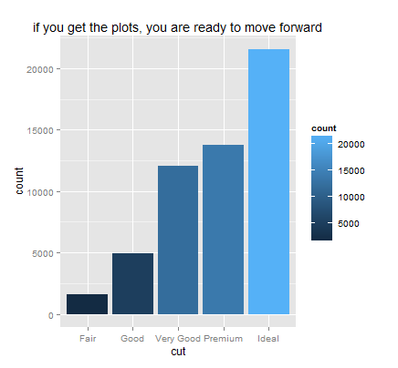

R Programming Tutorial Notes
=========

### Contributor
[Berkay Celik]

### R Programming

As  written at the [R web page]:

> R is a language and environment for statistical computing and graphics. 
> provides a wide variety of statistical (linear and nonlinear modelling, classical > statistical tests, time-series analysis, classification, clustering, ...) and 
> graphical techniques, and is highly extensible. The S language is often the
> vehicle of choice for research in statistical methodology, and R provides an Open Source route to participation in that activity.


#### Introduction

Tutorials are based on the great book of [R for Everyone: Advanced Analytics and Graphics] (Addison-Wesley Data & Analytics Series) by Jared P. Lander (Dec 29, 2013)

[](http://www.jaredlander.com/r-for-everyone/)

#### Tech

I use a number of open source projects for the tutorials:

* [RStudio] - awesome open source and enterprise-ready professional software for the R statistical computing environment.
* [MySQL Workbench] - visual tool for database architects, developers, and DBAs.
* [MiKTeX] - is an up-to-date implementation of TeX/LaTeX and related programs for Windows (required for using Knitr package in R for windows)
                    

#### Installation  R, and RStudio in Windows

*  Download R from http://cran.us.r-project.org/ (“Download R x.x.x for Windows”) 
*  Install R. Leave all default settings in the installation options.
*  Download RStudio from http://rstudio.org/download/desktop 
*  Install RStudio, leave all default settings in the installation options
*  Open RStudio and type 1+1 and then Control+Enter, if you see 2 on console you have succeed installing R and RStudio

```{r addition}
1+1
```

* (Optional) Installing RCommander, go to the "Packages" on RStudio (lower right side) tab and click on "Install Packages", and type "Rcmdr" ensure that "Install dependencies" is checked, and click “Install”. You can install any packages by this way. Install ggplot package, then type

```{r plot}
require(ggplot2)
data(diamonds)
head(diamonds)
```

```{r plot2, dev='png'}
ggplot(data=diamonds) + aes(x=cut) + geom_histogram(aes(fill = ..count..)) + ggtitle("if you get the plots, you are ready to move forward") 
```


*  Test R Commander by typing windows() in the console, if you see a new window you have succeed installing RCommander

### Files

  - first.r
    -  Basic structure of the R programming 
    -  Data structures used in R
  - readingDataIntoR.r
    -   Reading data from csv file
    -   Reading data from MySQL database (supplementary material can be found in /data)
  - statisticalGraphs.r
    -   Basic plotting with common functions
    -   Plotting with ggplot
  - basicsOfProgramming.r
    -   Common programming routines such as if statements, for and while loop  
  - basicStatistics (includes 3 .r files)
    - basicStatisticsDrawingNumbersFromPrDist.r
        -   Probability distributions (Normal, Binomial,Poisson), drawing numbers and computing densities
    - avgStdCorrelation.R
        - 	Calculate averages, standard deviations and correlations
	- tTestAndAnalysisOfVariance.R
		-	Compare samples with t-tests and analysis of variance. In addition, includes brief introduction for normality tests.
  - Todo: <span style="color:red">Data Mungling, Linear Models, ... </span> (soon).

#### Instructions in following folders

* **tutorial/data/** includes the data used in tutorials
* **tutorial/notes/** includes tips for setting up envoirenments (e.g., Connect R to MySQL with RODBC using DSN)
* **tutorial/latex/** includes files of understanding the latex basics using knitr 


[R for Everyone: Advanced Analytics and Graphics]: http://www.jaredlander.com/r-for-everyone/
[RStudio]: http://www.rstudio.com/
[mySQL Workbench]: http://www.mysql.com/products/workbench/ 
[Berkay Celik]: http://www.linkedin.com/in/berkaycelik
[R web page]: http://www.r-project.org/
[MiKTeX]: http://miktex.org/
